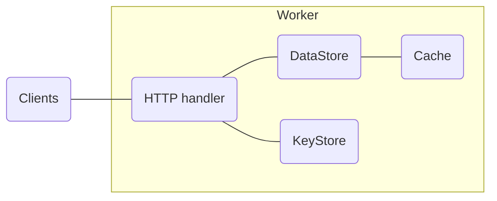

# auth-service

The auth-service is responsible for authenticating users and issuing JWTs. 

## Handlers

System Handlers:
- Canary
- Time
- Health

Identity Handlers:
- Join
- Leave
- Rotate

Session Handlers:
- Login
- Logout

Capability Handlers:
- Attest (verify)
- Accredit (sign)
