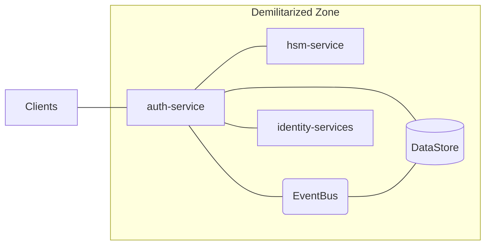

# Architecture

This section describes the components which makes up the architecture of the Janus system.

- [auth-service](10_auth-service.md)
- [hsm-service](20_hsm-service.md)
- [identity-services](30_identity-services.md)
- [DataStore](40_DataStore.md)
- [EventBus](50_EventBus.md)

