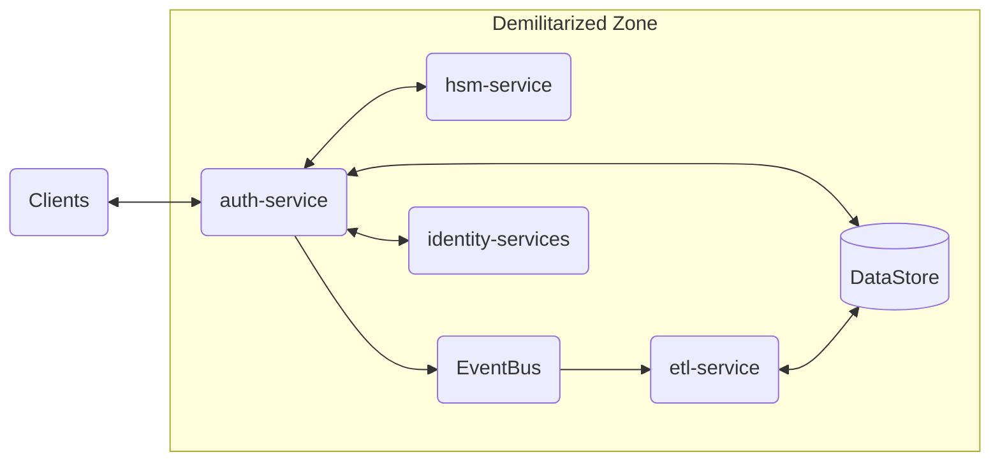

# Infrastructure

```mermaid
flowchart LR

    id1 <--> sid1

    subgraph dmz [Demilitarized Zone]
        sid1 <--> id3
        sid1 <--> sid2
        sid1 --> id4 --> sid4 <--> id3
        sid1 <--> sid3
    end

    sid1(auth-service)
    sid2(hsm-service)
    sid3(identity-services)
    sid4(etl-service)

    id1(Clients)
    id3[(DataStore)]
    id4(EventBus)
```
