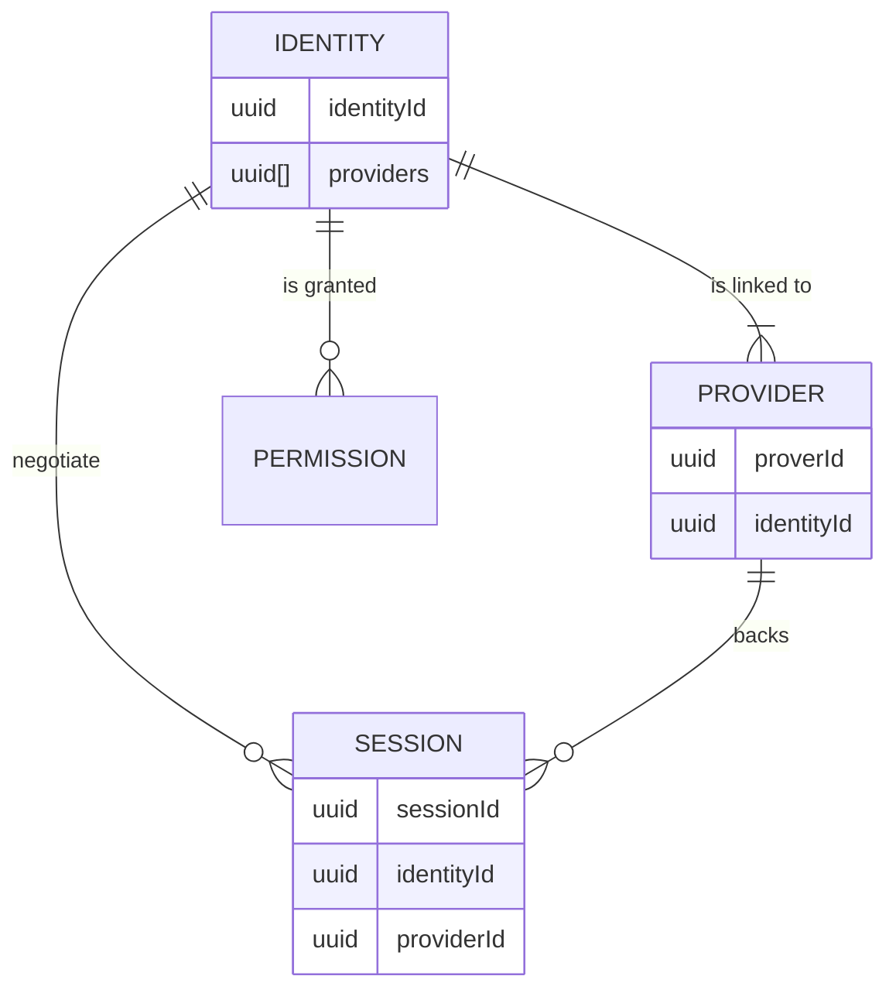

# EventBus

The etl-service is responsible for extracting, transforming, and loading data from the event bus into the data store.

```mermaid
erDiagram
    IDENTITY ||--|{ PROVIDER : "is linked to"
    IDENTITY ||--o{ SESSION : negotiate
    PROVIDER ||--o{ SESSION : backs
    IDENTITY ||--o{ PERMISSION : "is granted"

    IDENTITY {
        uuid identityId
        uuid[] providers
    }
    SESSION {
        uuid sessionId
        uuid identityId
        uuid providerId
    }
    PROVIDER {
        uuid proverId
        uuid identityId
    }
```
