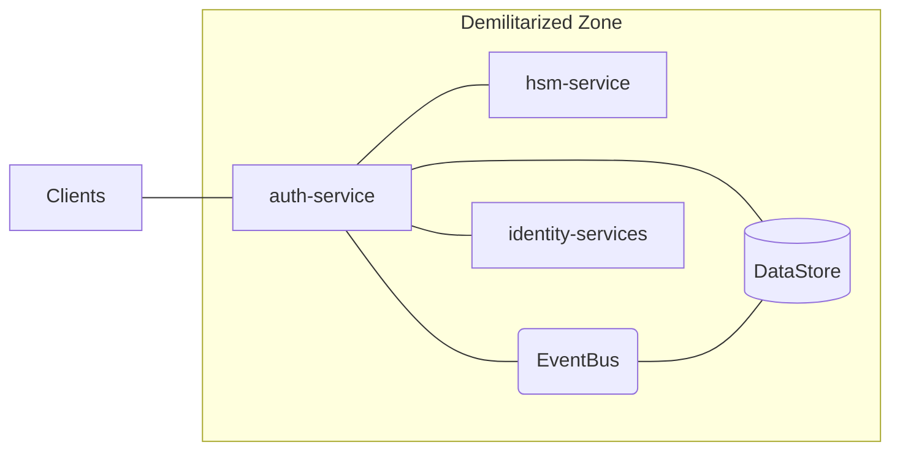
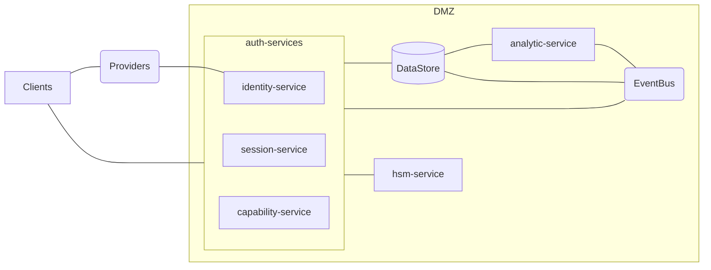

# Architecture

This section describes the components which makes up the architecture of the Janus system.

- Services
  - [auth-service](10_auth-service.md)
  - [hsm-service](20_hsm-service.md)
  - [identity-services](30_identity-services.md)
  - [DataStore](40_DataStore.md)
  - [EventBus](50_EventBus.md)
- [Providers](20_identity-services/20_providers.md)
- [Profiles](10_auth-service/30_profiles.md)
