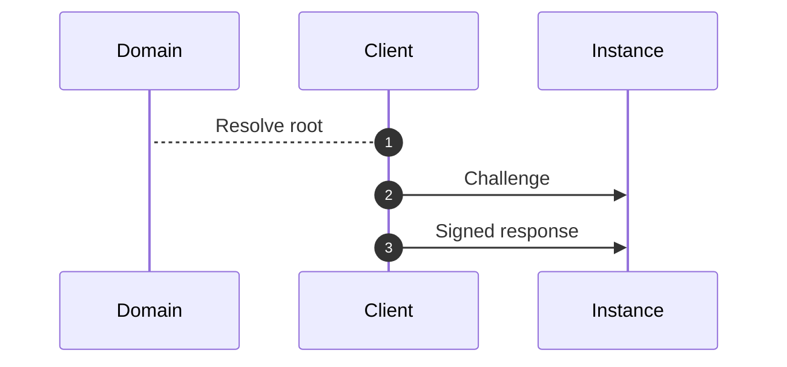

# System Protocol

## Canary

The client uses the canary event to produce a cryptographic
proof that the instance has ownership of a valid certificate,
and optionally to verify the chain of trust.

1. **Resolve root**

    The client resolves the root certificate of the domain.
2. **Send challenge**

    The client sends a challenge to the instance.
3. **Send signed response**

    The client signs the challenge with the private key of the root certificate, and sends it to the instance.

## Time

## Health
