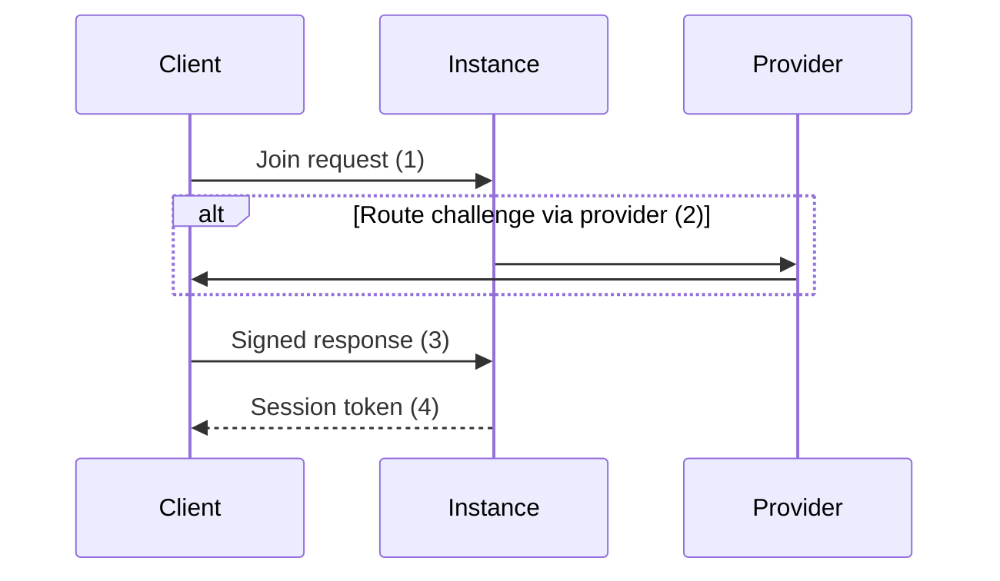

# Identity protocol

## Join

The join event is used to create a new identity and link
it to a provider. The client should send a [`canary` event](10_system.md#canary)
to verify the health of the instance before joining.

1. **Send join request**

   Hello Word
2. **Route challenge via provider**

   Hello Word
3. **Send response**

   Hello Word
4. **Send session token** (optional)

   Hello Word

## Leave

The leave event is used to delete an identity.

## Rotate

The rotate event is used to rotate the keypair of an identity.

## View

The view event is used to view the certificates associated with an identity.
