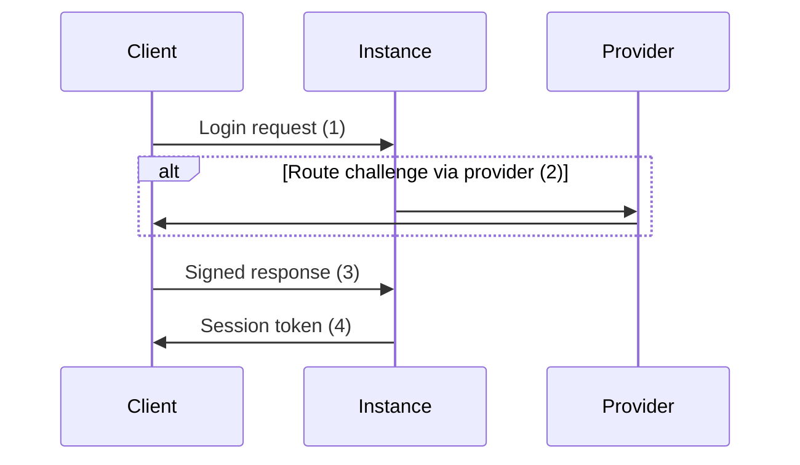
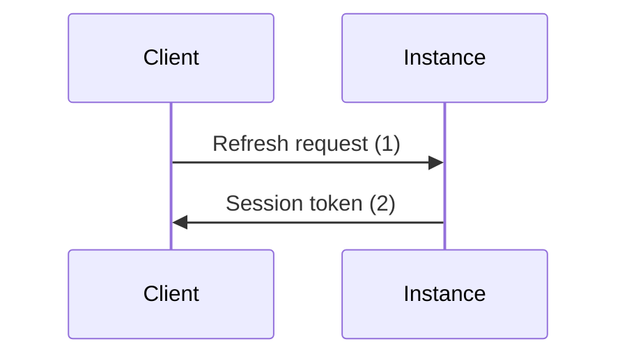

# Session protocols
details
## Login

The login event is used to negotiate a new session token on
a device that was never used before:



A session token looks like this:
```json
{
  "identityId": "uuid",
  "providerId": "uuid",
  "sessionId": "uuid",
  "timestamp": "date",
  "key": "spki",
  "secret": "base64",
  "signature": "base64"
}
```

## Refresh

The refresh event is used to refresh a session token in case
the client 



## Logout

The logout event is used to delete a session

## View

The view event is used to query for the details of a session.


